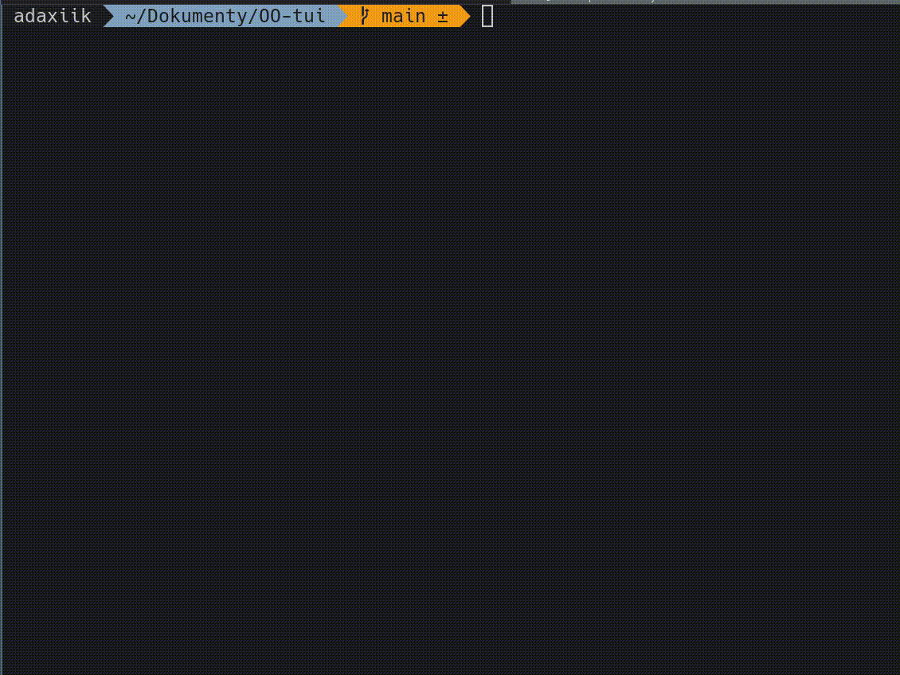

# OO-tui
Terminal "rendering" engine

I was supposed to do a OOP semester project, but at the same time I didn't want to do something completely useless

# Features
- Non-blocking keyboard input
- 8 Standardized colors
- Up to 144fps (tested on [alacritty](https://github.com/alacritty/alacritty) terminal. 80x30)

# Notes 
- It may not work on some terminals (that are too slow, or cant display colors)
- It may not work on windows (but not tested)
- Doesn't support multi-byte characters (extended ASCII, arrows, etc)
- More than 30fps can be laggy on some terminals

# Dependencies
- [ncurses](https://invisible-island.net/ncurses/ncurses.html) 


# Build
```sh
mkdir build
cd build
cmake ..
make
```

# Example


